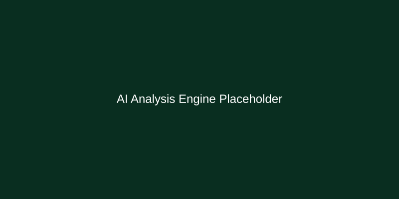

# AI Cyberbullying Social App - Backend (Django)


A powerful, AI-driven backend for a social media platform designed to proactively detect and mitigate cyberbullying. This project integrates Machine Learning models for real-time text and image analysis within a full-featured social networking API.

## 🔗 Connected Repositories
- **Frontend (Web UI)**: [AI-CyberBulling-Social-App-Web-UI](https://github.com/Rilan-Dev/AI-CyberBulling-Social-App-Web-UI.git)

## 🚀 Features

- **🛡️ AI-Powered Detection**: Real-time analysis of text and images for cyberbullying content using TensorFlow/Keras models.
- **🔐 Secure Authentication**: Robust JWT-based authentication system using `djangorestframework-simplejwt`.
- **👤 User Management**: Comprehensive user profiles, including bio, profile pictures, and follower/following system.
- **📝 Social Networking**: Full CRUD operations for posts and comments with built-in moderation flags.
- **📊 Automated Moderation**: Content is automatically flagged or blocked based on AI confidence scores and analysis results.
- **📖 Interactive API Docs**: Fully documented endpoints with Swagger and ReDoc integration.
- **🧪 Testing Suite**: Built-in test cases for serializers, views, and ML integration.

## 🧠 AI Integration & Architecture

This project implements a sophisticated AI-driven moderation workflow.

### 🔬 Machine Learning Models
- **Text Classification Model**: A custom **Keras/TensorFlow** model trained on cyberbullying datasets. It utilizes a **Tokenizer** and **Padding** sequence approach to categorize text into:
  - `age`, `ethnicity`, `religion` (Flagged/Blocked)
  - `not_cyberbullying` (Clean)
- **Image Classification Models**:
  - **Primary Model**: Detects `humour`, `negative`, and `offensive` visual content.
  - **Secondary Model (NSFW)**: Specifically targets `NSFW_Content` and `Offensive` imagery.
- **Preprocessing Pipeline**: 
  - Text: Lowercasing, Tokenization, and Padding (Max length: 100).
  - Image: RGB conversion, Resizing (224x224), and Normalization.

### 🔄 AI Workflow
1. **Content Submission**: When a user creates a Post or Comment, the data is intercepted by the backend.
2. **Analysis Pipeline**:
   - **Text Analysis**: Forwarded to the `text_classification_api` for real-time inference.
   - **Image Analysis**: Forwarded to the `image_classification_api` for visual scanning.
3. **Automated Moderation**:
   - The system calculates an **Overall Status** (`clean`, `flagged`, `blocked`) based on the most restrictive result from both text and image models.
   - **Confidence Scores**: Each prediction is saved with its confidence level to ensure moderation transparency.
4. **Persistence**: Analysis reports are stored as `JSONField` within the `Post` model and also logged in `TextAnalysisResult` and `ImageAnalysisResult` for historical auditing.

## 📸 Key Features Showcase

### 🛡️ AI Analysis Engine
Real-time processing of user-generated content to ensure platform safety.


### 📊 Moderation Dashboard
Automated flagging and blocking of harmful content based on confidence scores.


## 🛠️ Technical Stack

- **Framework**: Django 4.2.7 & Django REST Framework 3.14.0
- **AI/ML**: TensorFlow, Scikit-learn, NumPy, Pandas
- **Auth**: SimpleJWT (JSON Web Tokens)
- **Database**: SQLite (Development) / PostgreSQL (Production ready)
- **Documentation**: drf-yasg (Swagger/OpenAPI)
- **Image Processing**: Pillow (PIL)

## 📂 Project Structure

```
AI-CyberBulling-Social-App-Backend-Django/
├── project/                # Project configuration (settings, urls, asgi, wsgi)
├── cyberbullying/          # Main application logic
│   ├── models.py           # Database schemas (Post, Comment, UserProfile, etc.)
│   ├── views.py            # API ViewSets and logic
│   ├── ml_views.py         # AI analysis specific endpoints
│   ├── serializers.py      # DRF Serializers for data validation
│   └── tests/              # Unit and integration tests
├── media/                  # Uploaded and analyzed media files
├── requirements.txt        # Python dependencies
└── manage.py               # Django management script
```

## 📥 Installation

1. **Clone the repository**:
   ```bash
   git clone https://github.com/Rilan-Dev/AI-CyberBulling-Social-App-Backend-Django.git
   cd AI-CyberBulling-Social-App-Backend-Django
   ```

2. **Set up virtual environment**:
   ```bash
   python -m venv venv
   # Windows:
   .\venv\Scripts\activate
   # Linux/macOS:
   source venv/bin/activate
   ```

3. **Install dependencies**:
   ```bash
   pip install -r requirements.txt
   ```

4. **Run Migrations**:
   ```bash
   python manage.py migrate
   ```

5. **Create Superuser** (optional):
   ```bash
   python manage.py createsuperuser
   ```

6. **Start the server**:
   ```bash
   python manage.py runserver
   ```

## 🔌 API Documentation

Once the server is running, you can access the interactive documentation at:
- **Swagger UI**: `http://localhost:8000/swagger/`
- **ReDoc**: `http://localhost:8000/redoc/`

### Key Endpoints

| Endpoint | Method | Description |
|----------|--------|-------------|
| `/api/token/` | POST | Obtain JWT access/refresh tokens |
| `/api/users/register/` | POST | Register a new user |
| `/api/posts/` | GET/POST | List/Create social media posts |
| `/api/analyze-text/` | POST | Analyze raw text for cyberbullying |
| `/api/analyze-image/` | POST | Analyze an image for harmful content |

## 🧪 Testing

Run the test suite to ensure everything is working correctly:
```bash
python manage.py test cyberbullying
```

## 🤝 Contribution

Contributions are welcome! Please follow these steps:
1. Fork the project.
2. Create your feature branch (`git checkout -b feature/AmazingFeature`).
3. Commit your changes (`git commit -m 'Add some AmazingFeature'`).
4. Push to the branch (`git push origin feature/AmazingFeature`).
5. Open a Pull Request.

## 📄 License

Distributed under the MIT License. See `LICENSE` for more information.

---
*Developed as part of the AI Cyberbullying Prevention Initiative.*
